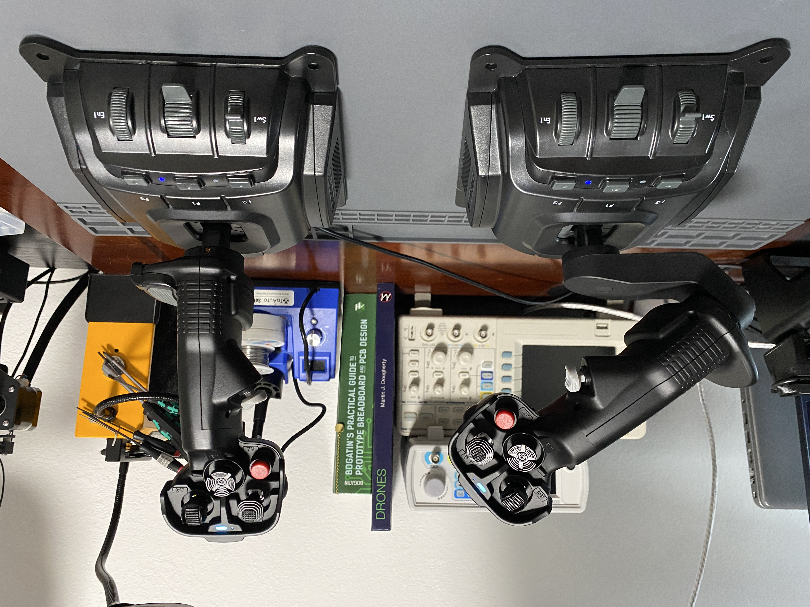
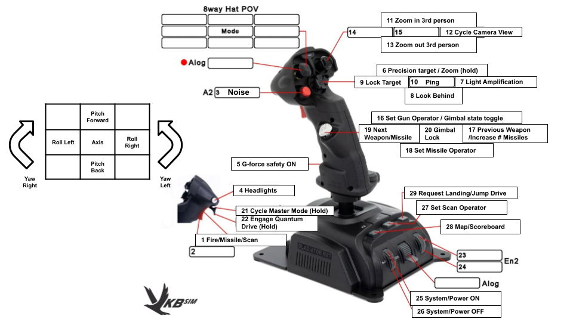
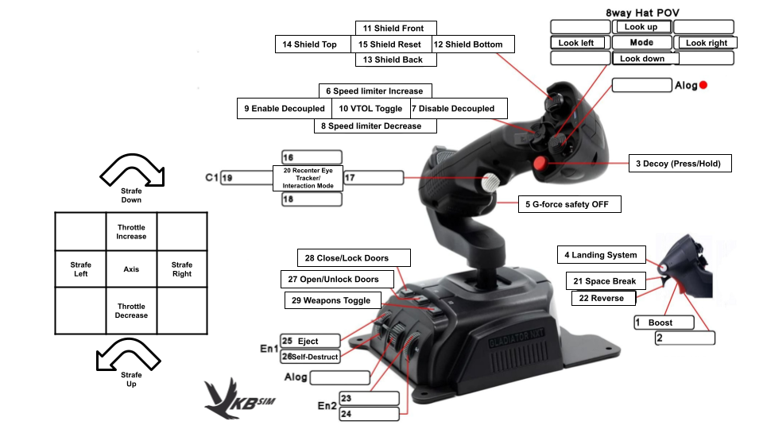
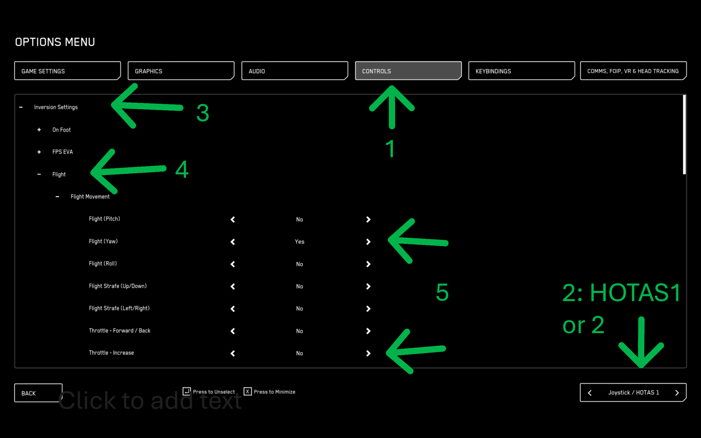
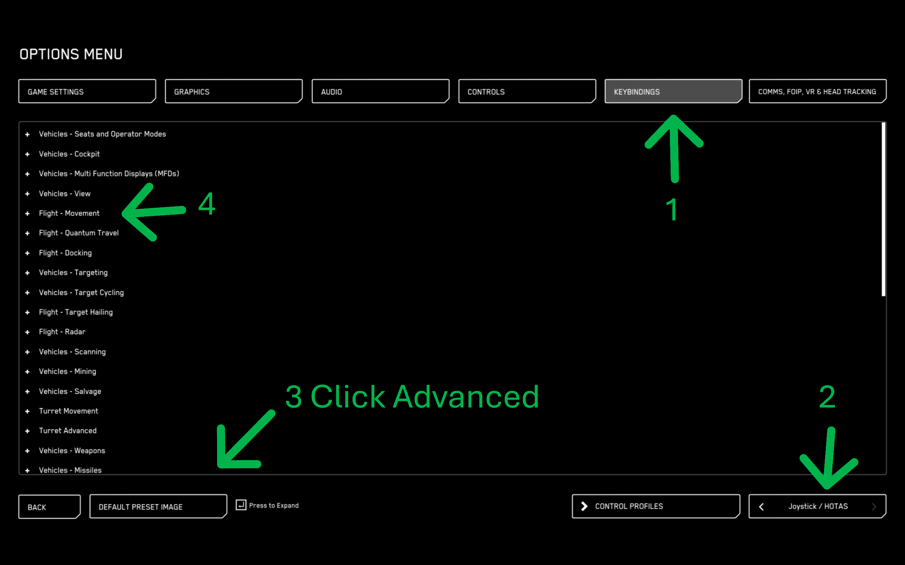

# vkb-hotas
VKB HOTAS Desktop setup



[Gladiator NXT EVO PREMIUM ‘Space Combat Edition’ - Right Hand ](https://vkbsimcontrollers.com/products/gladiator-nxt-evo-space-combat-edition-right-hand-us)

[Gladiator NXT EVO PREMIUM Omni Throttle - Left Hand (US)](https://vkbsimcontrollers.com/products/gladiator-nxt-evo-omni-throttle-left-hand-us?pr_prod_strat=jac&pr_rec_id=8ab160c84&pr_rec_pid=9119399936219&pr_ref_pid=9108837925083&pr_seq=uniform)

---

## Star Citizen
- Paired with [Tobii Eye Tracker 5](https://gaming.tobii.com/product/eye-tracker-5/?srsltid=AfmBOoouAlN1TuKeLzV7XhrUoyY-jWwelDJJvWeCZPXIBLF8Df3Kmk-l)





## Common Issues

### Left and Right Sticks Are Swapped

1. Open the in-game console with `~`.
2. Paste one of the following commands and test:

```text
pp_resortdevices joystick 1 2
```

or

```text
pp_resortdevices joystick 2 1
```

---

### Invert Pitch, Roll, Yaw, or Throttle

1. Go to **Options → Controls**.
2. Select **HOTAS 1** or **HOTAS 2**.
3. Open the **Inversion Settings** tab.
4. Expand **Flight Movement**.
5. Find the control you want to invert and toggle its inversion.



---

### Reassign Buttons

1. Go to **Options → Keybindings**.
2. Select the appropriate **HOTAS** device.
3. Click **Advanced Controls Customization**.
4. Browse the categories and assign or modify the desired button bindings.

